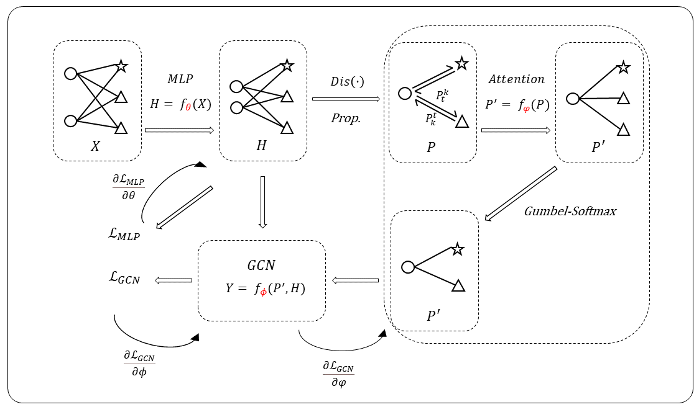

# He-HGNN
Source code of Master's degree thesis: "Homophily-enhanced Heterogeneous Graph Neural Networks"

Model scheme:  
  

  

# Requirements
1. Python >= 3.6.8
2. Pytorch >= 1.3.0
# Datasets
The row/processed data are provided here: [data](https://www.aliyundrive.com/s/W6EKEkH5hKb) 
# Useage
Take "yelp" dataset as an example: python run_yelp.py
# Reference
This paper and codes are mainly inspired by ["MAGNN: Metapath Aggregated Graph Neural Network for Heterogeneous Graph Embedding"](https://github.com/cynricfu/MAGNN)
